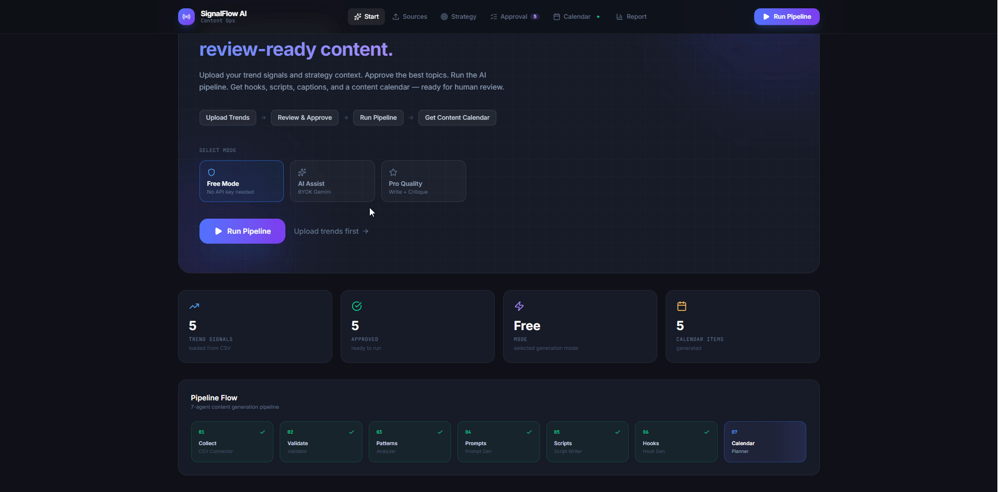
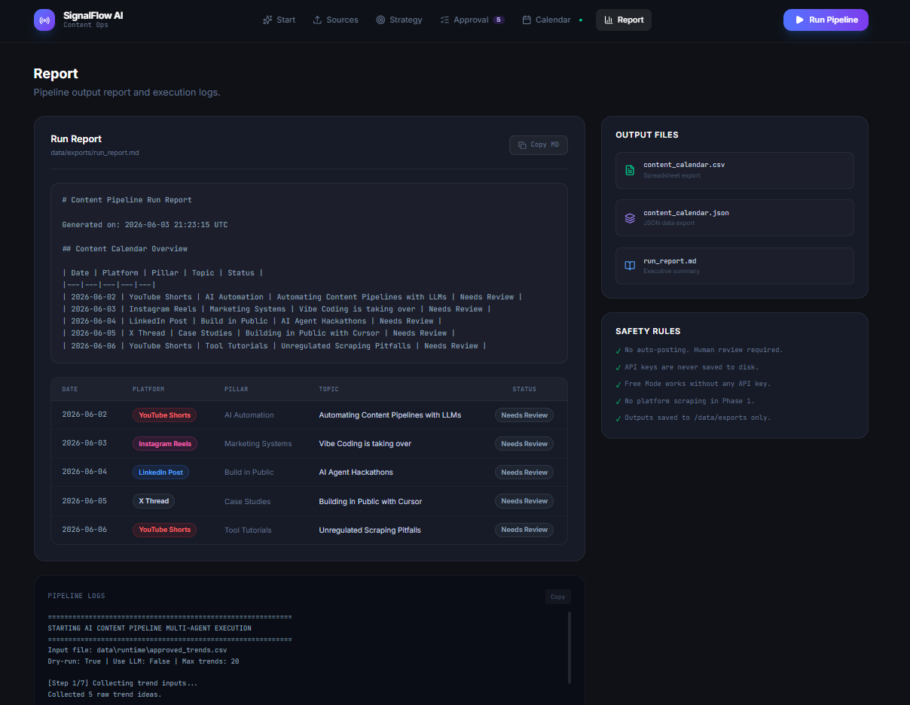
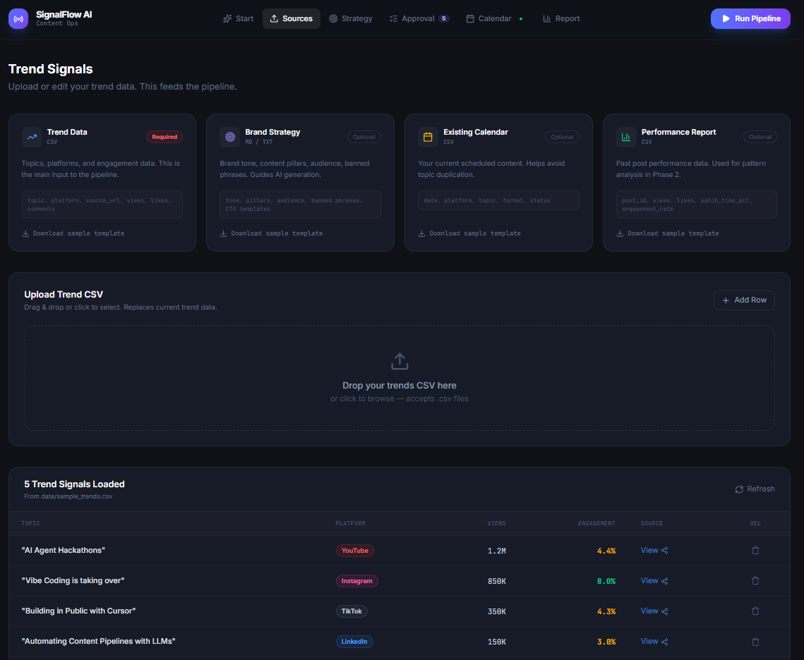
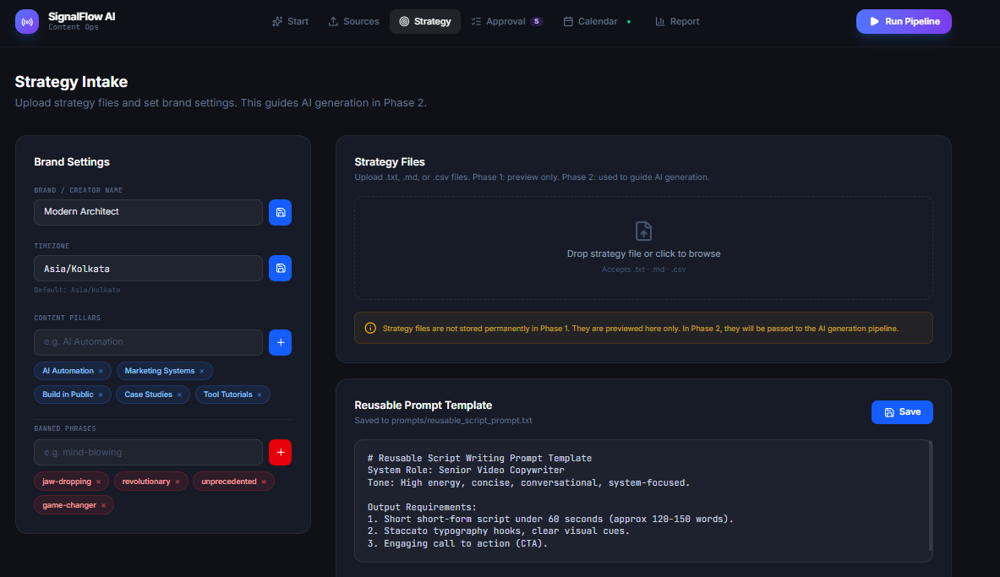
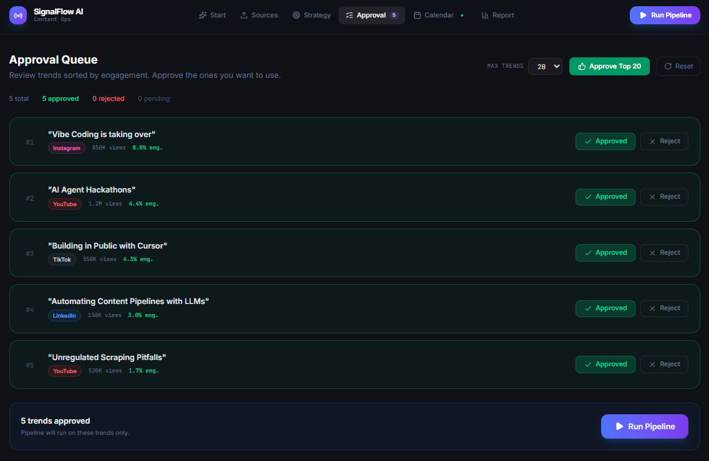
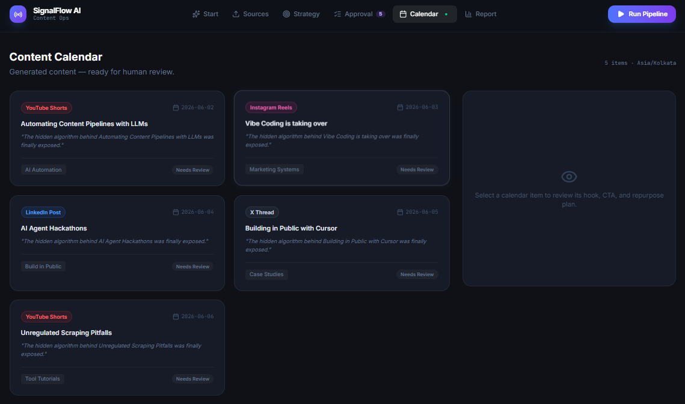
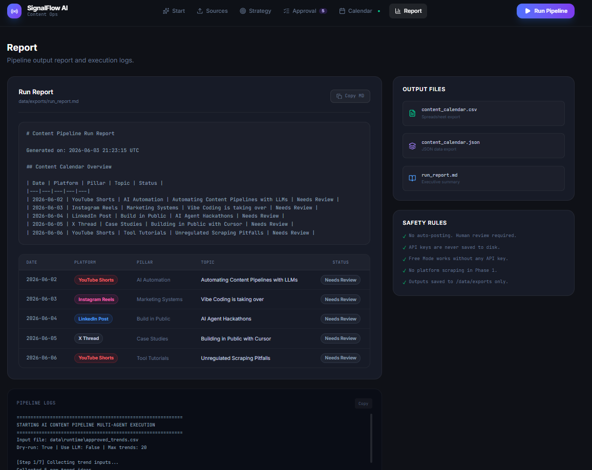

# SignalFlow AI

**Turn trends, strategy, and performance data into review-ready content calendars.**

A portfolio-ready AI content operations dashboard with a local multi-agent Python pipeline, a React dashboard, and a clean human approval workflow.

---

## Demo



### Demo Flow

**Start dashboard** -> **upload trend sources** -> **set brand strategy** -> **approve topics** -> **run pipeline** -> **review calendar and report**

---

## Screenshots

| Start Dashboard | Sources Upload |
|---|---|
|  |  |

| Strategy Intake | Approval Queue |
|---|---|
|  |  |

| Content Calendar | Run Report |
|---|---|
|  |  |

---

## What Problem This Solves

Most content creators and marketing teams spend hours manually:
- Scouting trending topics across platforms
- Deciding which trends fit their brand strategy
- Writing scripts, hooks, and captions for each post
- Building and maintaining a content calendar

SignalFlow AI brings those steps into a single local tool:
upload trend signals -> approve the best ones -> run the pipeline -> get review-ready content.

---

## Architecture

```
CSV Trend Input (data/sample_trends.csv)
       |
       v
[Connector] manual_csv.py       <- Reads and normalizes CSV columns
       |
       v
[Agent 1] validator.py          <- Scores topics: trend volume + engagement + creator fit
       |
       v
[Agent 2] pattern_analyzer.py   <- Extracts hook style, content angle, audience trigger
       |
       v
[Agent 3] prompt_generator.py   <- Generates reusable AI prompt templates per topic
       |
       v
[Agent 4] script_writer.py      <- Writes platform-specific short-form scripts
       |
       v
[Agent 5] hook_generator.py     <- Generates 5 hook variations per script
       |
       v
[Agent 6] calendar_planner.py   <- Schedules posts and exports the calendar
       |
       v
data/exports/
  +-- content_calendar.csv
  +-- content_calendar.json
  +-- run_report.md
```

**Frontend:** React + TypeScript + Tailwind v4
**Backend:** Express (TypeScript)
**Pipeline:** Python 3.10+ with Pydantic validation
**Validation:** Pydantic schemas in `schemas/`

---

## Data Input Types

| Input | File | Format | Required |
|---|---|---|---|
| Trend Signals | `data/sample_trends.csv` | CSV | Yes |
| Brand Strategy | strategy doc | `.md` / `.txt` | No |
| Existing Calendar | calendar file | `.csv` | No |
| Performance Report | analytics export | `.csv` | No |

### Supported CSV column names

The pipeline accepts both legacy and new column formats:

| Concept | Accepted column names |
|---|---|
| Topic / Title | `topic`, `trend_title`, `title` |
| Source URL | `source_url`, `url`, `post_url` |
| Views | `views` |
| Platform | `platform` |

---

## AI Modes

| Mode | What it does | API Key Required |
|---|---|---|
| **Free Mode** | Deterministic template generation, no LLM | No |
| **AI Assist** | BYOK Gemini API for LLM-generated content | Yes (your key) |
| **Pro Quality** | Write + critique + revise loop | Yes (your key) |

> API keys are passed only at run-time. Never saved to disk or logs.

---

## Setup

### 1. Install Python dependencies

```bash
python -m venv .venv

# Windows
.venv\Scripts\activate

# macOS / Linux
source .venv/bin/activate

pip install -r requirements.txt
```

### 2. Install Node dependencies

```bash
npm install
```

### 3. Configure environment (optional)

```bash
cp .env.example .env
# Add GEMINI_API_KEY only if you want AI Assist / Pro Quality mode
```

---

## Running the App

### Start the full dashboard (frontend + backend)

```bash
npm run dev
```

Open: **http://localhost:3000**

### Run the Python pipeline only (CLI)

```bash
# Free mode (no API key needed)
python -m workflows.run_pipeline --input data/sample_trends.csv --dry-run

# With the new extended template format
python -m workflows.run_pipeline --input data/templates/sample_trends.csv --dry-run

# Cap to top N trends by score
python -m workflows.run_pipeline --input data/sample_trends.csv --dry-run --max-trends 10

# With Gemini LLM (requires GEMINI_API_KEY in .env)
python -m workflows.run_pipeline --input data/sample_trends.csv --use-llm
```

---

## Running Tests

```bash
pytest
```

Tests cover:
- TrendInput schema validation
- Validator scoring logic (engagement, trend, creator fit)
- PatternAnalyzer output structure
- Legacy CSV format (`trend_title`, `url`)
- New CSV format (`topic`, `source_url`)
- Extended template format (all 14 columns)
- Error handling for invalid CSVs

---

## Output Files

After running the pipeline:

```
data/exports/
+-- content_calendar.csv    <- Spreadsheet-ready calendar
+-- content_calendar.json   <- JSON calendar for the dashboard
+-- run_report.md           <- Executive summary with stats
```

Temporary runtime files (from approved trends):

```
data/runtime/
+-- approved_trends.csv     <- Written per run, gitignored
```

---

## Safety Rules

- **No auto-posting.** All outputs require human review before publishing.
- **No API keys in code or files.** Use `.env` only. `.env` is gitignored.
- **No platform scraping.** Phase 1 uses CSV input only.
- **Free Mode works fully offline** without any paid API.
- **Pydantic validates all agent I/O** before passing between steps.

---

## Phase 1 (Completed)

- [x] CSV trend input with multi-format column support
- [x] 7-agent Python pipeline (validate -> analyze -> prompt -> script -> hooks -> calendar)
- [x] React dashboard with 6 tabs: Start, Sources, Strategy, Approval, Calendar, Report
- [x] AI mode selector (Free / AI Assist / Pro)
- [x] BYOK Gemini API key input (never stored)
- [x] CSV health check with clear error messages
- [x] Human approval queue sorted by engagement
- [x] Approved trends passed to pipeline as temporary CSV
- [x] Cross-platform Python runner (Windows + macOS/Linux)
- [x] `--max-trends` CLI flag to cap validated topics
- [x] Sample templates for all 4 input types
- [x] Tests for old and new CSV formats

---

## Phase 2 Roadmap

- [ ] Gemini LLM integration for AI Assist mode
- [ ] Strategy file parsing -- use brand tone to guide script generation
- [ ] Analytics feedback loop -- use past performance to weight topic selection
- [ ] Google Sheets export
- [ ] Notion / Airtable review board integration
- [ ] PDF parsing for strategy documents
- [ ] YouTube, Reddit, Google Trends API connectors
- [ ] Multi-platform scheduler

---

## Local Directory Structure

```
ai-multi-agent-content-pipeline/
+-- agents/              # Individual pipeline agents
+-- connectors/          # Data ingestion (manual CSV)
+-- creator_memory/      # Tone rules, pillars, banned phrases
+-- data/
|   +-- sample_trends.csv
|   +-- templates/       # Sample files for download
|   +-- exports/         # Generated outputs (gitignored)
+-- prompts/             # Prompt templates
+-- schemas/             # Pydantic data contracts
+-- tests/               # Pytest test suite
+-- workflows/           # Pipeline entry points
+-- src/                 # React frontend
+-- server.ts            # Express backend
+-- README.md
```

---

*SignalFlow AI -- Phase 1 MVP. Not affiliated with any platform. No scraping. No auto-posting.*
